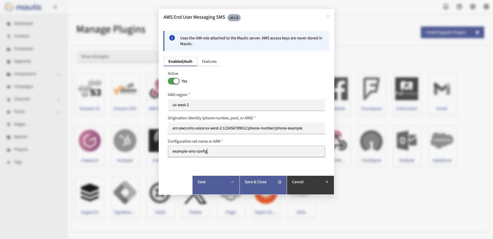
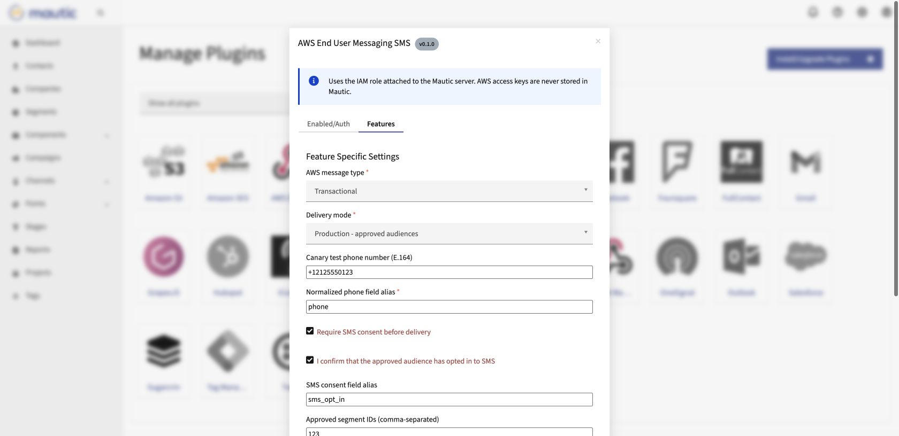
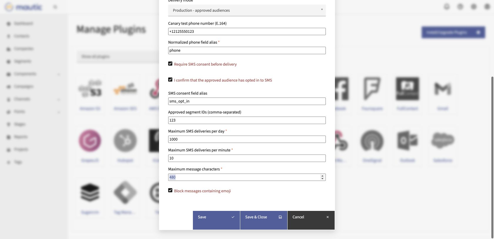
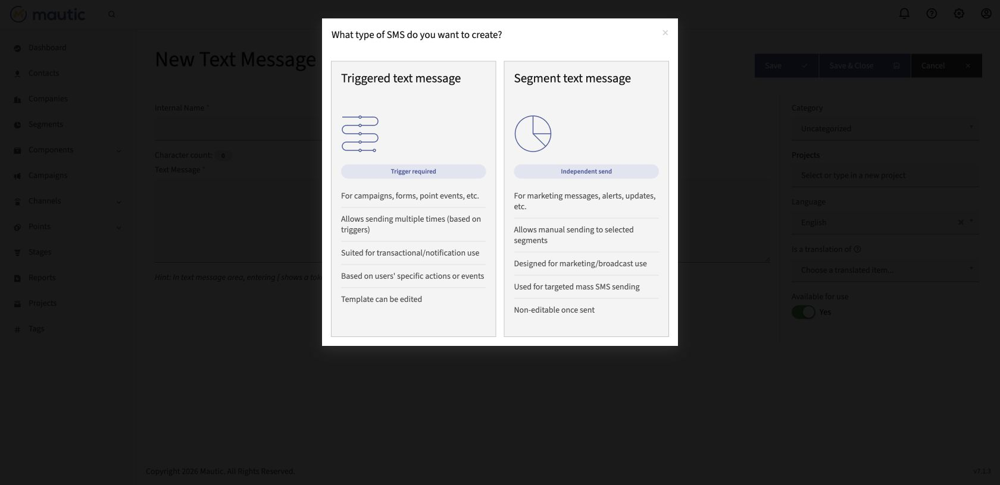
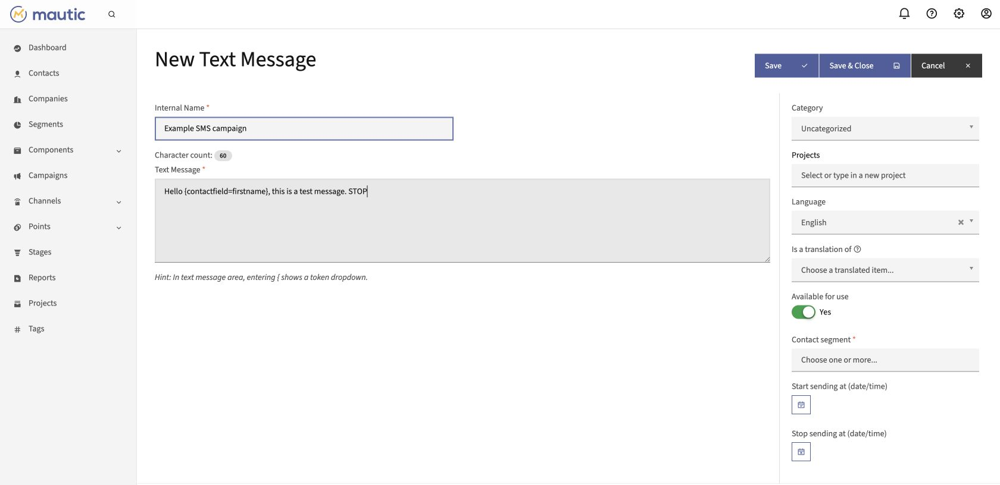

# Installation and operation guide

This guide covers installation, AWS prerequisites, Mautic configuration, canary testing, and sending a text SMS to an approved segment without n8n.

The screenshots use example values. Replace them with the values from your own AWS account and Mautic instance. Do not publish screenshots containing account IDs, ARNs, phone numbers, contact records, access keys, or private URLs.

## 1. Prerequisites

Before installing the plugin, prepare:

- Mautic 7.x with PHP 8.2 or 8.3.
- The AWS SDK for PHP available through the Mautic Composer installation.
- An AWS End User Messaging SMS origination identity approved for your country and message type.
- An AWS configuration set, for example `example-sms-config`.
- An EC2 instance profile or another AWS default credential provider attached to the Mautic host.
- An IAM policy that grants `sms-voice:SendTextMessage` only to the approved SMS resources.
- A Mautic phone field that contains values that can be normalized to E.164.
- A Mautic consent field and an approved segment containing only contacts who opted in to SMS.

The plugin uses the AWS role attached to the Mautic server. Do not paste AWS access keys into Mautic or commit them to this repository.

## 2. Install the plugin

For a Composer-managed Mautic installation:

```bash
composer config repositories.mautic-aws-eum-sms vcs https://github.com/beto2l/mautic-aws-eum-sms.git
composer require beto2l/mautic-aws-eum-sms:^1.0
php bin/console mautic:plugins:reload
php bin/console cache:clear --no-warmup
php bin/console cache:warmup
```

Once the package is available on Packagist, the repository configuration is not needed:

```bash
composer require beto2l/mautic-aws-eum-sms:^1.0
php bin/console mautic:plugins:reload
```

For a non-Composer installation, copy the repository to:

```text
plugins/AwsEndUserMessagingSmsBundle/
```

Then clear the Mautic cache and reload plugins from the Mautic installation directory.

## 3. Configure Enabled/Auth

Open **Settings > Plugins > AWS End User Messaging SMS** and select the **Enabled/Auth** tab.



Configure the following fields:

1. Turn **Active** on.
2. Enter the AWS region where the SMS identity and configuration set exist.
3. Enter the phone number, pool, or complete ARN used as the origination identity.
4. Enter the configuration set name or ARN.
5. Keep delivery in a non-production mode until the canary test succeeds.

The origination identity field is intentionally blank in the public screenshot. Enter your own phone number, pool, or ARN locally; a phone number or ARN from another AWS account will not work.

## 4. Configure SMS safety controls

Select the **Features** tab.



Set these controls deliberately:

- **AWS message type**: choose `Transactional` or `Promotional` according to the approved use case.
- **Delivery mode**: use `Locked - do not send` during setup, then `Canary - test phone only`, and finally `Production - approved audiences`.
- **Canary test phone number**: use one E.164 number that you control.
- **Normalized phone field alias**: use the exact Mautic field alias containing the recipient phone number, such as `phone` or `whatsapp_number`.
- **Require SMS consent before delivery**: keep this enabled for opted-in messaging.
- **I confirm that the approved audience has opted in to SMS**: check this only after verifying the audience and consent records.
- **SMS consent field alias**: enter the exact Mautic consent-field alias, such as `sms_opt_in`.
- **Approved segment IDs**: enter only the segment IDs authorized for SMS delivery.



The daily and per-minute limits are application safeguards. Set them below the limits approved for your AWS account and your operating policy. The plugin paces native Mautic workers so concurrent workers do not send a burst that exceeds the configured rate.

## 5. Run a canary test

1. Save the plugin configuration with **Canary - test phone only** selected.
2. Open **Channels > AWS SMS**.
3. Create a test text message and use a short message ending with the required opt-out language for your use case.
4. Attach the message to a campaign or use the supported Mautic sending workflow.
5. Confirm that the test phone receives the message.
6. Review the Mautic message statistics and the Mautic logs for the AWS response.
7. Stop and correct the configuration if the phone field, consent check, segment check, or AWS request fails.

The plugin does not require n8n for delivery. Mautic's native SMS transport and its normal cron processing handle the request.

## 6. Create a segment SMS

For a one-time broadcast, open **Channels > AWS SMS > New Text Message** and select **Segment text message**.





1. Enter an internal name that identifies the message and date.
2. Write the SMS text and keep it within the configured character limit.
3. Use Mautic tokens only when the referenced contact field is populated for every recipient, for example `{contactfield=firstname}`.
4. Select the approved opt-in segment. Do not select the entire database unless it is the approved, consented audience.
5. Set a start and stop time when the campaign requires a delivery window.
6. Save the message and review the final audience before making it available.
7. After the canary has passed, select `Production - approved audiences` in the plugin and save the setting.
8. Start the send through Mautic and allow the normal Mautic cron workers to process it.

For behavior triggered by a campaign event, choose **Triggered text message** instead and add the SMS event to the campaign. A segment SMS is intended for an independent, manual send.

## 7. Verify the send

Use the SMS message view in Mautic to review the contacts recorded as sent and the message statistics. The plugin's accepted count means that Mautic successfully submitted the request to AWS; it is not proof that the handset received the message.

For final handset delivery, failure, and carrier status, configure an AWS event destination and a processing path for those events. Keep credentials, contact data, and unredacted logs out of screenshots and support requests.

## 8. Support

For an error report, use the [support and error reporting instructions](../SUPPORT.md). Email is supported for people who do not use GitHub.
